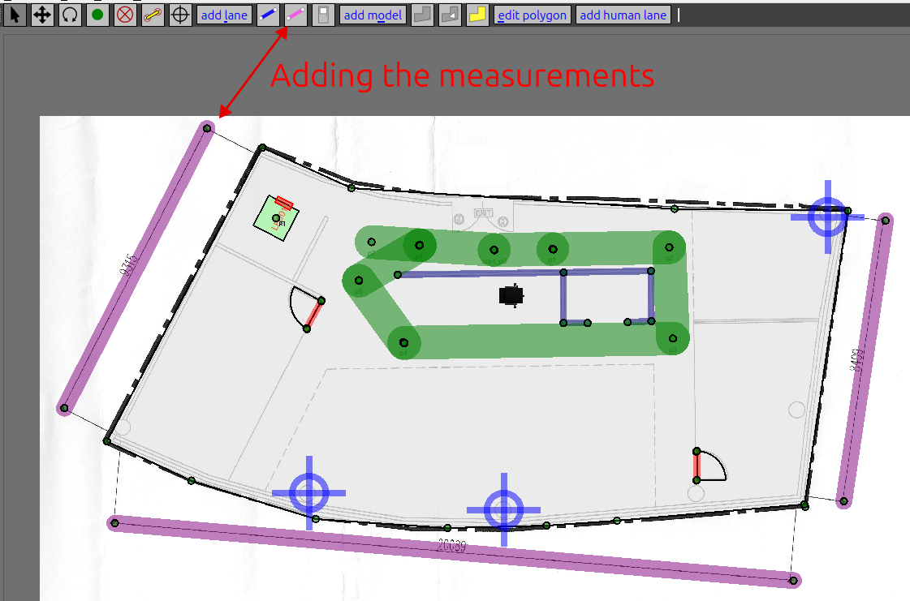

# open-rmf_getting_started
This is a OP1319 repository that contains a getting started tutorial to use the Open-RMF and its tools.

# Roadmap
There are a few options to follow:
1. Run the Open-RMF demos: install the Open-RMF from binaries and follow the tutorial until the [rmf_demos section](#testing-a-demo).
2. Create a custom map: install the Open-RMF from binaries and follow the tutorial until the [custom map section](#running-a-custom-map).
3. If you wish to use the rmf_web: install from binaries and follow the tutorial until the [rmf_web section](#get-the-rmf-web)
4. If you wish to have full control over the Open-RMF: install from source and do all the sections in this tutorial.

## README sections
- [open-rmf\_getting\_started](#open-rmf_getting_started)
- [Roadmap](#roadmap)
  - [README sections](#readme-sections)
- [ROS 2](#ros-2)
- [Gazebo installation](#gazebo-installation)
- [Gazebo ROS 2 installation](#gazebo-ros-2-installation)
- [Open-RMF](#open-rmf)
  - [Preparation to install the Open-RMF](#preparation-to-install-the-open-rmf)
  - [Choose your Open-RMF installation type](#choose-your-open-rmf-installation-type)
  - [Binary installation](#binary-installation)
  - [Building Open-RMF from source](#building-open-rmf-from-source)
    - [Download the source code](#download-the-source-code)
  - [Installing the rmf\_demos](#installing-the-rmf_demos)
  - [Testing a demo](#testing-a-demo)
- [Traffic Editor](#traffic-editor)
  - [Installation](#installation)
  - [Overview](#overview)
  - [Tips for the rmf-traffic-editor tutorial](#tips-for-the-rmf-traffic-editor-tutorial)
- [Running a custom map](#running-a-custom-map)
- [Additional tools](#additional-tools)
  - [Getting started with the rmf-web](#getting-started-with-the-rmf-web)
    - [Prerequisites](#prerequisites)
    - [Installing Open-RMF Web](#installing-open-rmf-web)
      - [Get the rmf-web](#get-the-rmf-web)
      - [Install dependencies](#install-dependencies)
      - [Launching for development](#launching-for-development)
      - [Configuration](#configuration)
  - [Docker](#docker)
    - [Prerequisites](#prerequisites-1)
    - [Install using the `apt` repository](#install-using-theaptrepository)
- [Solutions to some reported issues](#solutions-to-some-reported-issues)
  - [Gazebo issue with multicast](#gazebo-issue-with-multicast)

Extra tutorials:
- [Open-RMF custom map](open_rmf_custom_map/README.md)

# ROS 2
One of the main tools used in the project is ROS 2, which is used to communicate with the robots. This is the first thing to be installed.
Install ROS 2 by following the [ROS 2 official install guide](https://docs.ros.org/en/jazzy/Installation/Ubuntu-Install-Debs.html#).

**Important**: In the [ROS 2 official install guide](https://docs.ros.org/en/jazzy/Installation/Ubuntu-Install-Debs.html#), they recommend to install the ROS 2 desktop. However, we recommend everyone to install the ROS 2 full. By installing the ROS 2 full, the Gazebo Harmonic is installed automatically. Thus, you may skip the [Gazebo section](#gazebo-installation), you will only need the [Gazebo ROS 2 section](#gazebo-ros-2-installation). To install the ROS 2 full, when you reach the [install part](https://docs.ros.org/en/jazzy/Installation/Ubuntu-Install-Debs.html#install-ros-2) of the ROS 2 install guide, run the command:
```shell
sudo apt install ros-jazzy-desktop-full
```
In the ROS 2 official install guide, they install only the ROS 2 desktop.

# Gazebo installation
Another main tool used in the project is the Gazebo simulator. We are using the Gazebo Harmonic.

> If you installed the ROS 2 full in the [ROS 2 section](#ros-2), there is no need to install the Gazebo Harmonic again and you may skip this section. Continue in the [Gazebo ROS 2 section](#gazebo-ros-2-installation). For the sake of documentation, and for the case we want to install only the ROS 2 desktop in the final application, we will leave this section here.

We need to install both the Gazebo and the Gazebo ROS 2 packages. First, install Gazebo. **If only the Gazebo ROS 2 is installed, the demo examples may not run correctly.**

Follow the [Gazebo Harmonic installation guide](https://gazebosim.org/docs/harmonic/install_ubuntu/). Here follows a copy of the instructions.

Harmonic binaries are provided for Ubuntu Jammy (22.04) and Ubuntu Noble (24.04). The Harmonic binaries are hosted in the [packages.osrfoundation.org](http://packages.osrfoundation.org/) repository. To install all of them, the metapackage `gz-harmonic` can be installed.

First install some necessary tools:
```
sudo apt-get update
sudo apt-get install curl lsb-release gnupg
```

Then install Gazebo Harmonic:
```
sudo curl https://packages.osrfoundation.org/gazebo.gpg --output /usr/share/keyrings/pkgs-osrf-archive-keyring.gpg
echo "deb [arch=$(dpkg --print-architecture) signed-by=/usr/share/keyrings/pkgs-osrf-archive-keyring.gpg] http://packages.osrfoundation.org/gazebo/ubuntu-stable $(lsb_release -cs) main" | sudo tee /etc/apt/sources.list.d/gazebo-stable.list > /dev/null
sudo apt-get update
sudo apt-get install gz-harmonic
```
All libraries should be ready to use and the `gz sim` app ready to be executed.

**If the gazebo window does not load correctly, check the [multicast issue](#gazebo-issue-with-multicast).**

# Gazebo ROS 2 installation

> This Gazebo ROS 2 is required to run the Open-RMF demos. Thus, do not skip this section.

1. If you are using ROS 2, follow this [tutorial](https://gazebosim.org/docs/latest/ros_installation/#summary-of-compatible-ros-and-gazebo-combinations) to install the ROS 2 Gazebo Harmonic
2. Install it with : `sudo apt-get install ros-jazzy-ros-gz`

# Open-RMF
The Open-RMF is the other main tool used in the project. It is a robot fleet management system. It is ROS 2 based. To install it, you can follow the [official install guide](https://github.com/open-rmf/rmf/blob/main/README.md#setup). Since this is the most important part of the project, the installation steps are copied here. For the sake of clarity, some comments were removed. See them below. 

## Preparation to install the Open-RMF
Instruction below are aimed at `Ubuntu 24.04` with `ROS 2 Jazzy`.

First please install ROS 2 via binary debians as mentioned in [the ROS 2 section](#ros-2).

Install all non-ROS dependencies of Open-RMF packages,

```shell
sudo apt update && sudo apt install ros-dev-tools -y
```

The `rosdep` helps install dependencies for ROS packages across various distros and will be installed along with `ros-dev-tools`. However, it is important to update it.

```shell
# run if first time using rosdep.
sudo rosdep init 
rosdep update
```

Update `colcon mixin` if you have not done so previously.

```shell
colcon mixin add default https://raw.githubusercontent.com/colcon/colcon-mixin-repository/master/index.yaml
colcon mixin update default
```

## Choose your Open-RMF installation type
If you plan to develop new tools for the Open-RMF install it from source using the [install from source section](#building-open-rmf-from-source). if you just want to test the Open-RMF demos and do not plan to modify the Open-RMF source code [install it from binaries](#binary-installation). 

## Binary installation
First follow the instruction in the [Preparation section](#preparation-to-install-the-open-rmf). Now, install Open-RMF debian packages:

```shell
sudo apt update && sudo apt install ros-jazzy-rmf-dev
```

**Note:** This will install all necessary debian packages to run Open-RMF except for those in [rmf_demos](https://github.com/open-rmf/rmf_demos) for reasons described in this [issue](https://github.com/open-rmf/rmf_demos/issues/166). To install the demos check [the rmf_demos section](#installing-the-rmf_demos).

## Building Open-RMF from source
[Follow the official guide](https://github.com/open-rmf/rmf/blob/main/README.md#building-from-source), which is also presented below.

**Install Gazebo before installing the Open-RMF from source. Follow the instructions in the [Gazebo installation section](#gazebo-installation)**

**Do not try to install both ways (binary packages and from source).**

First follow the instruction in the [Setup section](https://github.com/open-rmf/rmf/blob/main/README.md#setup).

Due to newer changes in the source code, there might be conflicts and compilation errors with older header files installed by the binaries. Hence before proceeding, make sure to uninstall all Open-RMF binaries for the ROS 2 distro that will be sourced for the build.

```shell
sudo apt purge ros-<distro>-rmf* && sudo apt autoremove
```

### Download the source code

[](https://github.com/open-rmf/rmf/blob/main/README.md#download-the-source-code)

Open-RMF is a collection of several repositories/packages. The [rmf.repos](https://github.com/open-rmf/rmf/blob/main/rmf.repos) provides a snapshot of these packages. This repository stores different versions of this file depending on the ROS 2 distribution and version of the release. Depending on the use case, you may choose to download this file from one of the following branches in this repository:

- `main` : Latest version of all packages which may or may not have a binary release yet. This is recommended for development and bug fixes.
- `<distro>`: The latest version of the packages for a specific ROS 2 distro. This may be different from `main` as new API/ABI breaking features merged into `main` will not be backported into `<distro>` branches. The packages downloaded from `<distro>` may have changes that are not yet available in binaries.
- `<distro>-release` : Where `<distro>` is a supported ROS 2 distribution (eg. `humble`). The version of packages here will correspond to those of the latest binaries available for this distro.
- `release-<distro>-YYMMDD` : A tag for a specific `<distro>` where the version of packages correspond to those of the binaries available on `YYMMDD`. See [Releases](https://github.com/open-rmf/rmf/releases) for additional information for each release. This is useful if users would like to build packages from an older release.

Setup a new ROS 2 workspace and pull in the demo repositories using `vcs`. Replace `main` with the branch of your choice.

```shell
mkdir -p ~/rmf_ws/src
cd ~/rmf_ws
wget https://raw.githubusercontent.com/open-rmf/rmf/main/rmf.repos
vcs import src < rmf.repos
```

Update your rosdep definitions and install dependencies via `rosdep`.

```shell
cd ~/rmf_ws
sudo apt update
rosdep update
source /opt/ros/jazzy/setup.bash # replace jazzy with preferred ROS 2 distro.
rosdep install --from-paths src --ignore-src --rosdistro $ROS_DISTRO -y
```

**NOTE: We strongly recommend compiling Open-RMF packages with `clang` as compiler and `lld` as linker.**

```shell
sudo apt update
sudo apt install clang clang-tools lldb lld libstdc++-12-dev
```

Compile the workspace after sourcing the ROS 2 distro of choice.

```shell
cd ~/rmf_ws
export CXX=clang++
export CC=clang
colcon build --mixin release lld
```

> If your computer does not allow installing python packages system wide, you will need to create a python virtual environment. Some of the Open-RMF packages will require additional python packages such as Python `cmake`.

NOTE: [If you have a problem]. The build process will require python cmake module to be installed. On Ubuntu 24.04 it is not possible to install it system wide. Thus, create a virtual environment with all the system packages and build within the package:
```bash
cd ~/rmf_ws
virtualenv --system-site-packages venv_build
. venv_build/bin/activate
pip install cmake
export CXX=clang++
export CC=clang
colcon build --mixin release lld
```

> NOTE: The first time the build occurs, many simulation models will be downloaded from Gazebo Fuel to populate the scene when the simulation is run. As a result, the first build can take a very long time depending on the server load and your internet connection (may be up to an hour). To build without downloading models append `--cmake-args -DNO_DOWNLOAD_MODELS=On` to the `colcon build`. 

After the build is completed, go to the [installing the rmf_demos section](#installing-the-rmf_demos).

## Installing the rmf_demos

> If you installed the Open-RMF from source following [the source install section](#building-open-rmf-from-source), you can skip the rmf_demos installation because they already come together with the source code. 

To build `rmf_demos` from source, first determine the version of `rmf_demos` that corresponds to the latest binary release for your distro. In this project we will use the `jazzy` version.

Other versions of `rmf_demos` for this release can be found in the `rmf.repos` file in the `humble-release` branch of this repository, for example [here](https://github.com/open-rmf/rmf/blob/591b0b9f34a021d81522a0af6f42ffcb5fc70293/rmf.repos#L5).

Next create a ROS 2 workspace and build `rmf_demos` from source. Replace the `2.0.3` tag below with the version of `rmf_demos` for your distribution.

```shell
mkdir ~/rmf_ws/src -p
cd ~/rmf_ws/src
git clone https://github.com/open-rmf/rmf_demos.git 
cd rmf_demos
git checkout jazzy
```

> If your computer does not allow installing python packages system wide, you will need to create a python virtual environment. Some of the Open-RMF packages will require additional python packages such as Python `cmake`.

The virtualenv is a self contained python environment separated from the system wide python installation. We need to create a virtualenv because Ubuntu 24.04 does not allow installing python packages system wide.
0. Install virtualenv: `sudo apt install virtualenv`
1. Go to the rmf_ws: `cd ~/rmf_ws`
2. Create the venv with the system wide python packages (check [this link](https://wiki.arcoslab.org/tutorials/python_venv_ros2)). We need to create the virtualenv with all the packages because of the ROS 2 packages: `virtualenv --system-site-packages venv_rmf_ros2`
3. Activate it: `. venv_rmf_ros2/bin/activate`
4. **Python cmake is required** : `pip install cmake`

Now, build the workspace after the virtual environment is activated:
```shell
cd ~/rmf_ws
colcon build
```

**If you installed the open-rmf from the binary packages, you need to install some ROS 2 dependencies to run the demo examples correctly:**
```shell
cd ~/rmf_ws
rosdep install -i --from-path src --rosdistro jazzy -y
colcon build
```
The command above should fix any missing dependency to run the demos.

## Testing a demo
To run some demonstrations of Open-RMF in simulation, see [README in rmf_demos](https://github.com/open-rmf/rmf_demos). There you can find the command to run different ready demos from Open-RMF. **Do not forget to change to the `jazzy` branch on the rmf_demos repository.**

Try running the hotel demo:
```shell
cd ~/rmf_ws
source /opt/ros/jazzy/setup.bash
source ~/rmf_ws/install/setup.bash
ros2 launch rmf_demos_gz hotel.launch.xml
```

The demo should open with RViz and Gazebo. 

**If the gazebo window does not load correctly, check the [multicast issue](#gazebo-issue-with-multicast).**

Next, run the following command in a new terminal to command the robots in the scene:
```
source /opt/ros/jazzy/setup.bash
source ~/rmf_ws/install/setup.bash
ros2 run rmf_demos_tasks dispatch_patrol -p restaurant  L3_master_suite -n 1 --use_sim_time
ros2 run rmf_demos_tasks dispatch_clean -cs clean_lobby --use_sim_time
```
If everything works, the robots should start moving.

To run some demonstrations of Open-RMF in simulation, see [README in the rmf_demos repository](https://github.com/open-rmf/rmf_demos). **Always remember to change to the jazzy branch in the rmf_demos repository.**

# Traffic Editor

This tutorial was copied from the [original traffic editor repository](https://github.com/open-rmf/rmf_traffic_editor).

## [Installation](https://github.com/open-rmf/rmf_traffic_editor#installation)

This repository is structured as a collection of ROS 2 packages and can be built using `colcon`. For full installation of RMF, please refer to [here](https://github.com/open-rmf/rmf).

The `rmf_building_map_tools` package requires the following Python 3 dependencies to generate worlds:

```shell
sudo apt install python3-shapely python3-yaml python3-requests
```

Clone the repository to your computer:

```shell
git clone https://github.com/open-rmf/rmf_traffic_editor.git
```

Go to the repository folder and source ROS 2 and the previous installed rmf workspace:
```shell
cd rmf_traffic_editor
source /opt/ros/jazzy/setup.bash
source ~/rmf_ws/install/setup.bash
```

You will need python cmake to build the ROS 2 rmf traffic editor packages. Thus, we need to create and activate a python virtual environment to install cmake python since Ubuntu 24.04 does not allow installing python packages system wide:
```shell
virtualenv --system-site-packages venv_rmf_traffic_editor
. venv_rmf_traffic_editor/bin/activate
```

After activating the virtualenv, install python cmake package:
```shell
pip install cmake
```

Now, you can build the packages form the rmf_traffic_editor inside the rmf_traffic_editor folder:
```shell
cd ~/rmf_traffic_editor
colcon build
```

To test if the traffic editor installation was successfull source the rmf_traffic_editor and run it:
```shell
source ~/rmf_traffic_editor/install/setup.bash
traffic-editor
```

## Overview

Most things here were copied from the [official open-rmf book](https://osrf.github.io/ros2multirobotbook/traffic-editor.html).

The traffic-editor is composed of the GUI and other tools to auto-generate simulation worlds from GUI outputs. The GUI is a interface that create and annotate 2D floor plans with robot traffic along with building infrastructure information. Also, existing floor plans of the environment, such as architectural drawings can be opened, which simplify the task and provide a "reference" coordinate system for vendor-specific maps. For such cases, `traffic-editor` can import these types of "backgroud images" to serve as a canvas upon which to draw the intended robot traffic maps, and to make it easy to trace the important wall segments required for simulation.

The `traffic_editor` GUI projects are stored as `yaml` files with `.building.yaml` file extensions. Although the typical workflow uses the GUI and does not require hand-editing the `yaml` files directly, we have used a `yaml` file format to make it easy to parse using custom scripting if needed. Each `.building.yaml` file includes several attributes for each level in the site as annotated by the user. An empty `.building.yaml` file appears below. The GUI tries to make it easy to add and update content to these file.

```yaml
levels: 
	L1: doors: 
		- [] 
		- drawing: 
		- filename: 
		- fiducials: 
		- elevation: 0 
		- flattened_x_offset: 0 
		- flattened_y_offset: 0 
		- floors: 
			- parameters: {} 
			- vertices: [] 
		- lanes: 
			- [] 
		- layers: 
			{} 
		- measurements: 
			- [] 
		- models: 
			- {} 
		- vertices: 
			{} 
		walls: 
			{} 
lifts: 
	{} 
	name: building
```
 

**At this point, we recommend you to read the [official rmf book sections about the traffic-editor](https://osrf.github.io/ros2multirobotbook/traffic-editor.html).  Please read all the sections from GUI Layout until the Conclusion section. This tutorial will make you learn how to create a new scenario to be used with the open-rmf.**

## Tips for the rmf-traffic-editor tutorial
- Some ready map examples can be found in your rmf_ws folder where you installed the open-rf. They are under the folder: `/rmf_ws/src/demonstrations/rmf_demos/rmf_demos_maps/maps`
- We recommend to do the tutorial with the office map, which is the same from the [official tutorial](https://osrf.github.io/ros2multirobotbook/traffic-editor.html) for the traffic-editor.
- To use run the [traffic-editor tutorial](https://osrf.github.io/ros2multirobotbook/traffic-editor.html), we highly recommend you to copy (duplicate) the office map to another folder and open it from there instead of working on the `rmf_demos_maps`.
- **The first thing you should do after you open the traffic-editor and load your map .png file is to add the measurements on all the known measurements in the map. After adding the measurements (the pink lines), save the map, close the editor and open it again. The traffic-editor will automatically rescale everything.**

- Adding floor polygon: first add the vertices (green dots) of the polygon and next connect them with the floog polygon tool.
- If for some reason the zooming of the map behaves strange or if everything in the map vanish for every opened map. Click on the **View** tab and reset the zoom. The map should appear again.
- **Adding feature points**: make sure you select the correct level when adding the feature point. Select the level map to add points on the level map and select the map_scan (the name you gave for the scan of the map) to add features to the scan. Connect the features from the level with the features of the scan using the **Add constraint** option. Last, click on `Edit > Optimize Layer Transform`. The scan and the map should align automatically.

# Running a custom map
Follow the tutorial on the [custom map tutorial page](open_rmf_custom_map/README.md).

# Additional tools
There are some additional tools that may be usefull for some more advanced applications with Open-RMF. 

## Getting started with the rmf-web

This tutorial was copied from the  [official rmf-web repository](https://github.com/open-rmf/rmf-web#getting-started-from-source)

### [Prerequisites](https://github.com/open-rmf/rmf-web#prerequisites)

We currently support [Ubuntu 24.04](https://releases.ubuntu.com/noble/), [ROS 2 Jazzy](https://docs.ros.org/en/jazzy/index.html) and the latest Open-RMF release. Other distributions may work as well, but is not guaranteed.

Install pnpm and nodejs

```shell
curl -fsSL https://get.pnpm.io/install.sh | bash -
# after installing, source your bashrc file
source ~/.bashrc
pnpm env use --global lts
```

For Debian/Ubuntu systems,

```shell
sudo apt install python3-pip python3-venv
```

### Installing Open-RMF Web
To run the Open-RMF web with the demos, you need to have followed the [rmf_demos section](#installing-the-rmf_demos).

#### Get the rmf-web

Clone the [rmf-web repository](git@github.com:open-rmf/rmf-web.git) . 
```
git clone https://github.com/open-rmf/rmf-web.git
```

#### [Install dependencies](https://github.com/open-rmf/rmf-web#install-dependencies)

Run the following commands to install the rmf-web things.

```shell
cd path/to/rmf-web
pnpm install
```

#### [Launching for development](https://github.com/open-rmf/rmf-web#launching-for-development)

Source Open-RMF and launch the demo dashboard in development mode. To do this, first we need to start the api-server:

```shell
# For binary installation
source /opt/ros/jazzy/setup.bash

# For source build: source the rmf_ws you installed in the steps above
source /path/to/your/rmf/workspace/install/setup.bash

cd path/to/your/rmf-web
cd packages/api-server
pnpm start
```

This starts up the API server (by default at port 8000) which sets up endpoints to communicate with an Open-RMF deployment, as well as begin compilation of the demo dashboard. 

Next, we start the rmf-dashboard-framework. To do this, open a new terminal and do the following:
```shell
# For binary installation
source /opt/ros/jazzy/setup.bash

# For source build: source the rmf_ws you installed in the steps above
source /path/to/your/rmf/workspace/install/setup.bash

cd path/to/your/rmf-web
cd packages/rmf-dashboard-framework
pnpm start:example examples/demo
```

Once completed, the dashboard can be viewed at [localhost:5173](http://localhost:5173/).

If presented with a login screen, use `user=admin password=admin`.

Ensure that the fleet adapters in the Open-RMF deployment is configured to use the endpoints of the API server. By default it is `http://localhost:8000/_internal`. Launching a simulation from [`rmf_demos_gz`](https://github.com/open-rmf/rmf_demos) for example, the command would be,

```shell
ros2 launch rmf_demos_gz office.launch.xml server_uri:="http://localhost:8000/_internal"
```

Now you can dispatch tasks using the rmf-web interface clicking at [localhost:5173](http://localhost:5173/).

#### [Configuration](https://github.com/open-rmf/rmf-web/tree/main#configuration)

- See the [api-server](https://github.com/open-rmf/rmf-web/blob/main/packages/api-server/README.md#configuration) docs for API server run-time configurations.
- [rmf-dashboard-framework](https://github.com/open-rmf/rmf-web/blob/main/packages/api-server/README.md) allows you to easily build a dashboard.


## Docker
Now, to use some open-rmf tools, it will be useful to install docker because some tools provide docker files ready to run (for example, [rmf-web](https://github.com/open-rmf/rmf-web)).

This instructions were copied from the [official docker tutorial](https://docs.docker.com/desktop/setup/install/linux/ubuntu/).

### [Prerequisites](https://docs.docker.com/desktop/setup/install/linux/ubuntu/#prerequisites)

To install Docker Desktop successfully, you must:

- Meet the [general system requirements](https://docs.docker.com/desktop/setup/install/linux/#general-system-requirements).
- Have an x86-64 system with Ubuntu 22.04, 24.04, or the latest non-LTS version.
- For non-Gnome Desktop environments, `gnome-terminal` must be installed:
    
    ```console
    $ sudo apt install gnome-terminal
    ```
**Note**: Although the [official docker installation](https://docs.docker.com/desktop/setup/install/linux/ubuntu/#prerequisites) says it requires `gnome-terminal`, other terminals work as well such as `Allacrity` and `Wezterm`. Thus, you can try to use other terminals instead of `gnome-terminal`.

### [Install using the `apt` repository](https://docs.docker.com/engine/install/ubuntu/#install-using-the-repository)

Before you install Docker Engine for the first time on a new host machine, you need to set up the Docker `apt` repository. Afterward, you can install and update Docker from the repository.

1. Set up Docker's `apt` repository.
    
    ```bash
    # Add Docker's official GPG key:
    sudo apt-get update
    sudo apt-get install ca-certificates curl
    sudo install -m 0755 -d /etc/apt/keyrings
    sudo curl -fsSL https://download.docker.com/linux/ubuntu/gpg -o /etc/apt/keyrings/docker.asc
    sudo chmod a+r /etc/apt/keyrings/docker.asc
    
    # Add the repository to Apt sources:
    echo \
      "deb [arch=$(dpkg --print-architecture) signed-by=/etc/apt/keyrings/docker.asc] https://download.docker.com/linux/ubuntu \
      $(. /etc/os-release && echo "$VERSION_CODENAME") stable" | \
      sudo tee /etc/apt/sources.list.d/docker.list > /dev/null
    sudo apt-get update
    ```
    
    > **Note**
    > 
    > If you use an Ubuntu derivative distribution, such as Linux Mint, you may need to use `UBUNTU_CODENAME` instead of `VERSION_CODENAME`.
    
2. Install the Docker packages.
    
    Latest Specific version
    
    ---
    
    To install the latest version, run:
    
    ```console
    $ sudo apt-get install docker-ce docker-ce-cli containerd.io docker-buildx-plugin docker-compose-plugin
    ```
    
    ---
    
3. Verify that the installation is successful by running the `hello-world` image:
    
    ```console
    $ sudo docker run hello-world
    ```
    
    This command downloads a test image and runs it in a container. When the container runs, it prints a confirmation message and exits.
    

You have now successfully installed and started Docker Engine.

# Solutions to some reported issues
## Gazebo issue with multicast
Thanks to Gabriel Elan (@Elan-gab) for spotting and solving the problem.

When running rmf_demos_gz package, an 'Gazebo Sim' window opens alongside with rviz, but does not respond, even after a long time waiting. The cause of this problem is described [here](https://github.com/gazebosim/gz-sim/issues/2522) and [here](https://github.com/gazebosim/gz-transport/issues/476#issuecomment-2282728388) as a network configuration issue that is caused by firewall restrictions. This [troubleshooting](https://docs.ros.org/en/rolling/How-To-Guides/Installation-Troubleshooting.html#enable-multicast) suggests enabling multicast, which resolved the problem.

To test the multcast issue run:
```shell
ros2 multicast receive
```

In another terminal, run:
```
ros2 multicast send
```

If the receiver does not respond, multicast is being blocked by the firewall. To enable multicast:
```shell
sudo ufw allow in proto udp to 224.0.0.0/4
sudo ufw allow in proto udp from 224.0.0.0/4
```

