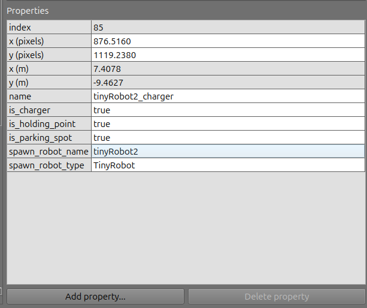
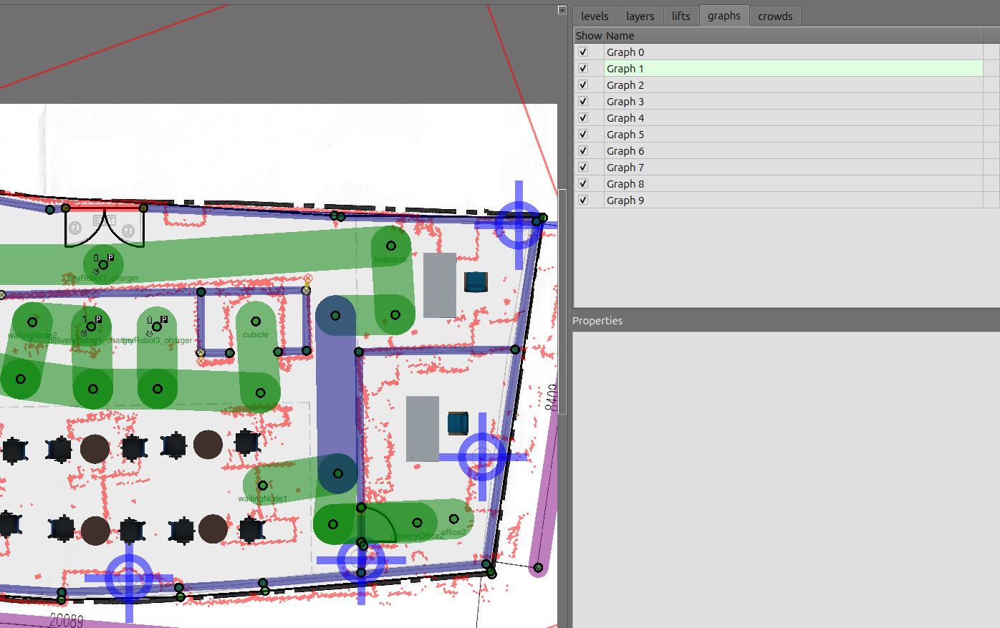

# Open-RMF-Custom-Map

## Preparing the custom map workspace folder
Create a RMF ROS 2 workspace directory:
```shell
mkdir -p rmf_ws_custom_map/src
```

Change to the `src`  folder:
```shell
cd rmf_ws_custom_map/src
```

Clone the Open-RMF demos repository in the workspace `src` folder:
```shell
git clone https://github.com/open-rmf/rmf_demos.git
```

Change to the `jazzy` branch (**this branch is more stable than the main branch for the ROS 2 jazzy**):
```shell
git checkout 
```

Change back to the workspace folder, check for missing dependencies:
```shell
cd ~/rmf_ws_custom_map
rosdep install -i --from-path src --rosdistro jazzy -y
```

Create a python virtual environment with system wide packages and activate it:
```shell
virtualenv --system-site-packages venv_custom_maps
. venv_custom_maps/bin/activate
```

Install Python cmake in the virtualenv:
```shell
pip install cmake
```

Source your ROS 2 installation and build the workspace:
```shell
source /opt/ros/jazzy/setup.bash
colcon build
```
**If the `colcon build` result in any packages not being built correctly, run it a second time. After the second time, all packages will probably be built, not sure why.**


Now, after the build finished, source the workspace:
```shell 
source ~/rmf_ws_custom_map/install/setup.bash
```

Let us check if the build worked by running a demo example. Source your open-rmf installation (that you installed from source) and run the demo:
```shell
# source the open-rmf installation from source
source ~/rmf_ws/install/setup.bash
# Run the office demo
ros2 launch rmf_demos_gz office.launch.xml
```
The RViz window should open quickly, but the Gazebo Window may take a while depending on your computer specifications (CPU, GPU, and so on). **If Gazebo does not open on the first try, close the RViz and kill the demo command on the terminal and run it again. Wait some time for the Gazebo to open.**

Before closing the demo run from the last step, try running a task. Open a new terminal, source the ROS 2 installation, source the `~/rmf_ws`   installation, source the `rmf_ws_custom_map` and run the task command:
```shell
source /opt/ros/jazzy/setup.bash
source ~/rmf_ws/install/setup.bash
source ~/rmf_ws_custom_map/install/setup.bash
ros2 run rmf_demos_tasks dispatch_delivery -p pantry -ph coke_dispenser -d hardware_2 -dh coke_ingestor --use_sim_time
```
The robot 2 should go to the pantry, get a coke and deliver to the coke ingestor.

## Changing the map 
Create your map in the `traffic-editor` and copy the saved `<your_map>.building.yaml` to the `~/rmf_ws_custom_map/src/rmf_demos/rmf_demos_maps/maps/office/office.building.yaml`with the same name. Name it as `office.building.yaml`. Inside the `office.building.yaml`  make sure the path to the `office.png` and to the `office_scan.png` is correct.

**If you want, you can try with [this map example of the custom office](maps/office.building.yaml). Just move it to the `~/rmf_ws_custom_map/src/rmf_demos/rmf_demos_maps/maps/office/` directory.**

Open a new terminal, source ROS 2 and source the workspace:
```shell
cd ~/rmf_ws_custom_map
source /opt/ros/jazzy/setup.bash
source install/setup.bash
```

Clean your workspace :
```shell
cd ~/rmf_ws_custom_map
rm -r install/ build/ log/
```

Build your workspace again and source it:
```shell
cd ~/rmf_ws_custom_map
colcon build
source install/setup.bash
```

**If your build fails because of python `cmake`, then activate the virtual environment: `. venv_custom_maps/bin/activate`.**

Now, when you run the office demo example, it will launch with your map:
```shell
ros2 launch rmf_demos_gz office.launch.xml
```

If you want to add robot nodes in the traffic editor, add the following properties to the node in the traffic editor by clicking on the node and clicking on `Add property`:



# Tips on the custom map
- Always make sure no two nodes have the same name. Otherwise, the lanes will not be loaded properly.
- For every robot on the scene, there must be a config for it. To do this modify the config file accordingly at `~/rmf_ws_custom_map/src/rmf_demos/rmf_demos/config/office`.
- To add new robots to the map, you need to add a config file for the robot at `~/rmf_ws_custom_map/src/rmf_demos/rmf_demos/config/office`. For example, if you want to add a deliveryRobot to the office demo, copy the deliveryRobot_config.yaml from the hotel example located at `/home/marcos/rmf_ws_custom_map/src/rmf_demos/rmf_demos/config/hotel/deliveryRobot_config.yaml`. Just make sure that **all the robot names** inside the `deliveryRobot_config.yaml` are the same from the robot you add/spawn in your map nodes created in the traffic-editor. Check the `name`, the `robots` and their subproperties (for example, the `charger` in the case of the delivery robot). All the name related things should mirror the robot node from the map `.building.yaml` created with the traffic editor.
- To add a new fleet with different robot types, call the new fleet in the file `~/rmf_ws_custom_map/src/rmf_demos/rmf_demos/launch/office.launch.xml` (we are using the office map as the example modified custom map). Do not forget to change the `nav_graphs/<fleet_number>.yaml` to the lane of the new fleet.
```xml
...
<!-- TinyRobot fleet adapter -->
  <group>
    <include file="$(find-pkg-share rmf_demos_fleet_adapter)/launch/fleet_adapter.launch.xml">
      <arg name="use_sim_time" value="$(var use_sim_time)"/>
      <arg name="nav_graph_file" value="$(find-pkg-share rmf_demos_maps)/maps/office/nav_graphs/0.yaml" />
      <arg name="config_file" value="$(find-pkg-share rmf_demos)/config/office/tinyRobot_config.yaml"/>
    </include>
  </group>

  <!-- ADDING A FLEET OF DeliveryRobot -->
  <!-- DeliveryRobot fleet adapter -->
  <group>
    <include file="$(find-pkg-share rmf_demos_fleet_adapter)/launch/fleet_adapter.launch.xml">
      <arg name="use_sim_time" value="$(var use_sim_time)"/>
      <arg name="nav_graph_file" value="$(find-pkg-share rmf_demos_maps)/maps/office/nav_graphs/0.yaml" />
      <arg name="config_file" value="$(find-pkg-share rmf_demos)/config/office/deliveryRobot_config.yaml"/>
    </include>
  </group>
```
- If you want to add the fleet on a new lane/route different, you need to change the lane graph in the traffic-editor. To do this, click on the lane you want to change and press a number from 0 to 10. It should change the color of the lane graph. Each graph correspond to a number and a color. The blue lane is on graph 1. When calling the fleet adapter on the `.launch.xml` just change the `nav_graphs` to the layer you want (in this case `1.yaml`):



# Issues
Some issues may happen. Here we leave some solutions.

## Adding new robots to the map
The traffic-editor should add everything you modify on the editor to the `.building.yaml` file. However, we had this issue on the first time the nodes for the new robots were added.

To add the robots to the map, you need to add them in the `crowd_sim` property of the `.building.yaml` file manually in the `agent_groups > agents_name > [add_names_here_separated_by_commas]`. Also, change the `agents_number` to the number of agents you inserted in the list:
```yaml
crowd_sim:
  agent_groups:
	  # Add the agents_name to the list of agents_name
    - {agents_name: [tinyRobot1, tinyRobot2], agents_number: 0, group_id: 0, profile_selector: external_agent, state_selector: external_static, x: 0, y: 0}
  agent_profiles:
    - {ORCA_tau: 1, ORCA_tauObst: 0.40000000000000002, class: 1, max_accel: 0, max_angle_vel: 0, max_neighbors: 10, max_speed: 0, name: external_agent, neighbor_dist: 5, obstacle_set: 1, pref_speed: 0, r: 0.25}
  enable: 0
  goal_sets: []
  model_types: []
  obstacle_set: {class: 1, file_name: L1_navmesh.nav, type: nav_mesh}
  states:
    - {final: 1, goal_set: -1, name: external_static, navmesh_file_name: ""}
  transitions: []
  update_time_step: 0.10000000000000001
```

After changing things on the `office.building.yaml`, rebuild your workspace with `colcon build` and launch the map:
```shell 
ros2 launch rmf_demos_gz office.launch.xml
```

Open a new terminal and send the tasks (this an example, you need to adapt it to your map):
```shell
ros2 run rmf_demos_tasks dispatch_patrol -p cubicle office2 -n 3 --use_sim_time
ros2 run rmf_demos_tasks dispatch_patrol -p deliveryOffice2 -n 3 --use_sim_time
```
